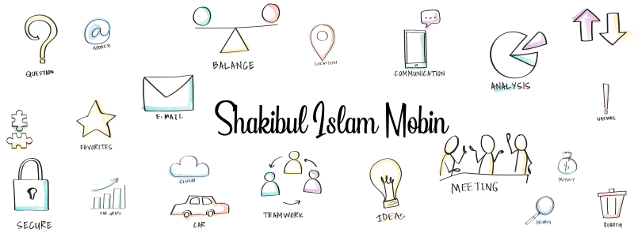
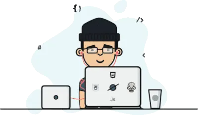
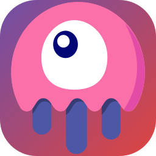

<!-- <h1 align="center">Shakibul Islam Mobin</h1> -->


<!-- <h3 align="center">A passionate full stack developer from BD</h3> -->
<h3 align="center">
        <samp>A passionate
              <b><a target="_blank" href="#">Full Stack Developer</a></b>
              from <b>BD</b>
        </samp>
</h3>
<br>

<!-- cSpell:disable -->
<details align="center">
<summary style="list-style: none;cursor: pointer;"><samp cursor="pointer">&#9675;&#9661;&#9634;<br>click!</samp></summary>

###

<a href="https://www.linkedin.com/in/md-shakibul-islam-858467272/" target="_blank" rel="noreferrer"> </a>
<a href="https://twitter.com/si_Mobin" target="_blank" rel="noreferrer"></a>
<a href="https://www.facebook.com/shakibul.mobin" target="_blank" rel="noreferrer"></a>
<a href="https://www.hackerrank.com/profile/shakibulislam" target="_blank" rel="noreferrer"></a>

<!-- <a href="#" target="_blank" rel="noreferrer"></a> -->

<!-- cSpell:enable -->

<!-- games -->

###


###

<a href="https://games.app.goo.gl/?link=https://play.google.com/games/invite?key%3DChVhXzg2NzI0MzM2NTUxMDI5MDQyMTcSCjE2OTMwNzAwODA%26cpi%3Da_8672433655102904217%26sig%3DANzvBXj6ZRzU4XkVUXTrNEvn2TLi&apn=com.google.android.play.games&st=Hey,+let's+be+friends+on+Google+Play+Games&amv=168350030&si=https://lh3.googleusercontent.com/_4qiNyc_TBz6yPe5pGy8V4GBByDmAJfmlnPSSaMHYT0Sz7PUBno0oal3YXOI_1nKxr-hQeukc9nKzjNO">
</a>


<a href="https://steamcommunity.com/id/siMobin/">
</a>


<a href="https://launcher.store.epicgames.com/u/cc8f2f33fe2f42a1bf074b9cf3dc69fd">
</a>
</details>

<!-- ### -->

<!-- profile views count -->
<!-- <p align="left"> </p> -->
<!-- follow button -->

<!-- 👉 **_I am always here ..._** [](https://github.com/login?return_to=https%3A%2F%2Fgithub.com%2FsiMobin) -->

---

<!-- trophy -->
<p align="center"></p>



```console
$ whoami
Just a variant rewriting timelines with code

$ uptime
System running on overthinking, frustration and
waiting for her appearance

$ cat contact.me
Email: shakibulislammobin@gmail.com
WhatsApp: +8801746-301800
```

<details>
<summary align="center" style="list-style: none;cursor: pointer;"><samp cursor="pointer">Terminal State of Mind (Click to explore)</samp></summary>
<br>

```console
$ cat /var/log/motivation.log | grep "success"
No matches found

$ rm -rf /life /depression /pain /failure
Operation not permitted - Dependency not found: soulmate.so

$ ls /emotions
No such file or directory

$ ping -c 1 reality
reality is unreachable (100% packet loss)

$ cat ~/heart.conf
Error: Module not found: soulmate.so

$ curl https://love.com/soulmate.so
curl: (408) Request Timeout – Reconnecting...

$ top
PID    USER         TASK
000   siMobin      overthinking
001   root         pretending-to-be-okay
002   siMobin      missing-her
003   siMobin      replaying-conversations
004   root         simulating-imaginary-future
005   siMobin      scrolling-old-chats
006   root         coding-to-escape

$ top -u siMobin
PID    USER         TASK
000   siMobin      loneliness
001   siMobin      desperation
002   siMobin      seeking-love
003   siMobin      wondering-where-she-is
004   siMobin      scrolling-through-memes

$ df -h /love
Not enough resources – Insufficient funds

$ sudo reboot --hope
Permission denied: Missing dependency — life partner not found
```

</details>

<hr>

<!-- tools -->
<!-- icon -->
<h3 align="center">Languages, Frameworks & Tools:</h3>

<br clear="both">

<div align="center">
  
  
  
  <!-- 
   -->
  
  
  
  
  
  
  
  
  
  
  
  
  
  
  
  
  
  
  
  
  <!-- 
   -->
  
  
  <!--  -->
  <!--  -->
  
  
  <!-- 
   -->
  
  
  
  

</div>

<!-- tools list -->

###

###

<!-- cSpell:disable -->
<div align="center">
  
  
  
  
  
  <!--  -->
  <!--  -->
  
  
  <!--  -->
  <!--  -->
  <!--  -->
  
  
  
  
  <!--  -->
  <!--  -->
  
  
  
  <!--  -->
</div>

###

###

<!-- charts -->

<div align="center">
  
  
  
  
</div>

<div align="center">


</div>

<!-- cSpell:enable -->

<!--
[
    ref: https://profile-readme-generator.com/
         https://github.com/maurodesouza/profile-readme-generator
]
 -->
