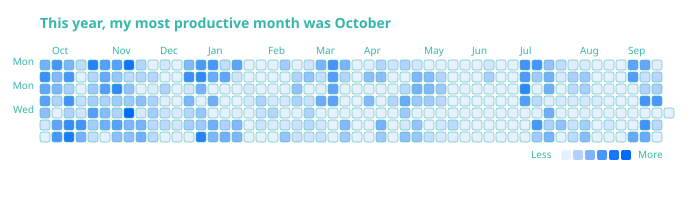

# WakaTime Stats

Generate 13 SVG stats cards from your WakaTime profile.

## Setup

```bash
python -m venv .venv
.venv\Scripts\activate
pip install -r requirements.txt
```

Create `.env`:

```
WAKATIME_API_KEY=your_key_here
WAKATIME_USERNAME=your_username
GITHUB_TOKEN=your_token    # optional, for GitHub-based rank
```

## Usage

```bash
python main.py
python main.py --theme hazel
```

SVGs are saved to `output/`.

## Cards

| Card          | Description                    |
| ------------- | ------------------------------ |
| basic         | Total time, languages, editors |
| heatmap       | Coding activity heatmap        |
| weekly        | Weekly time breakdown          |
| weekly_projs  | Weekly project breakdown       |
| weekly_langs  | Weekly language breakdown      |
| weekly_avg    | Weekday average hours          |
| all_langs     | All-time language breakdown    |
| all_projs     | All-time project breakdown     |
| ai_coding     | AI vs human coding stats       |
| ai_agent      | Per-model AI agent breakdown   |
| personal_info | Profile info card              |
| spedometer    | Daily goal progress            |
| rank          | Global WakaTime rank           |


